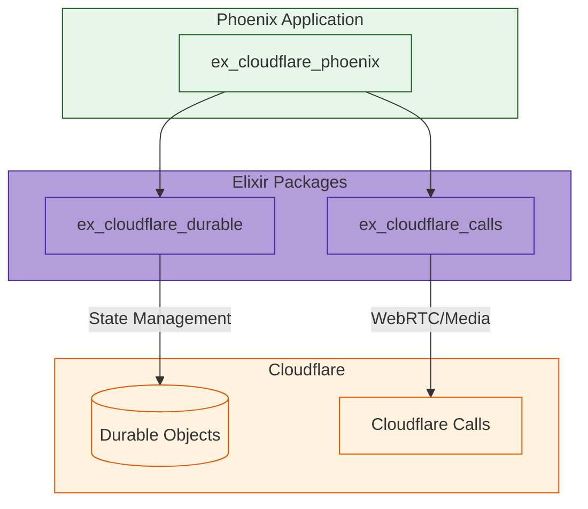
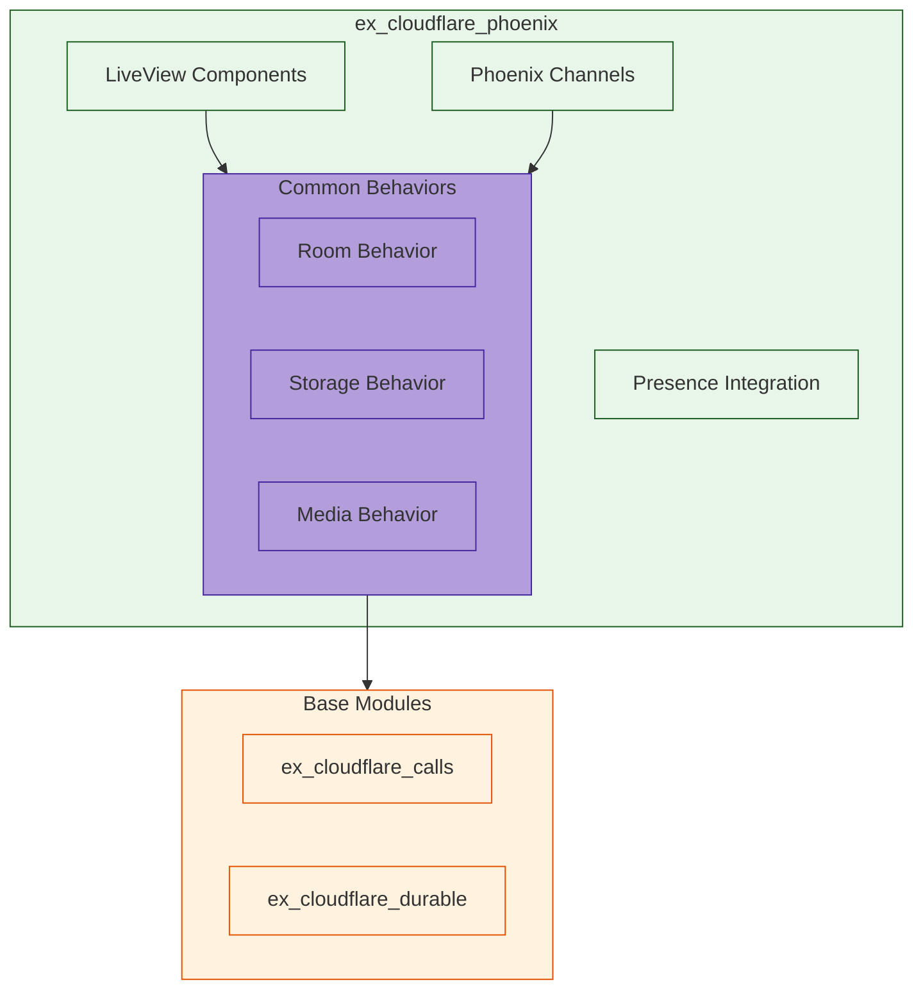
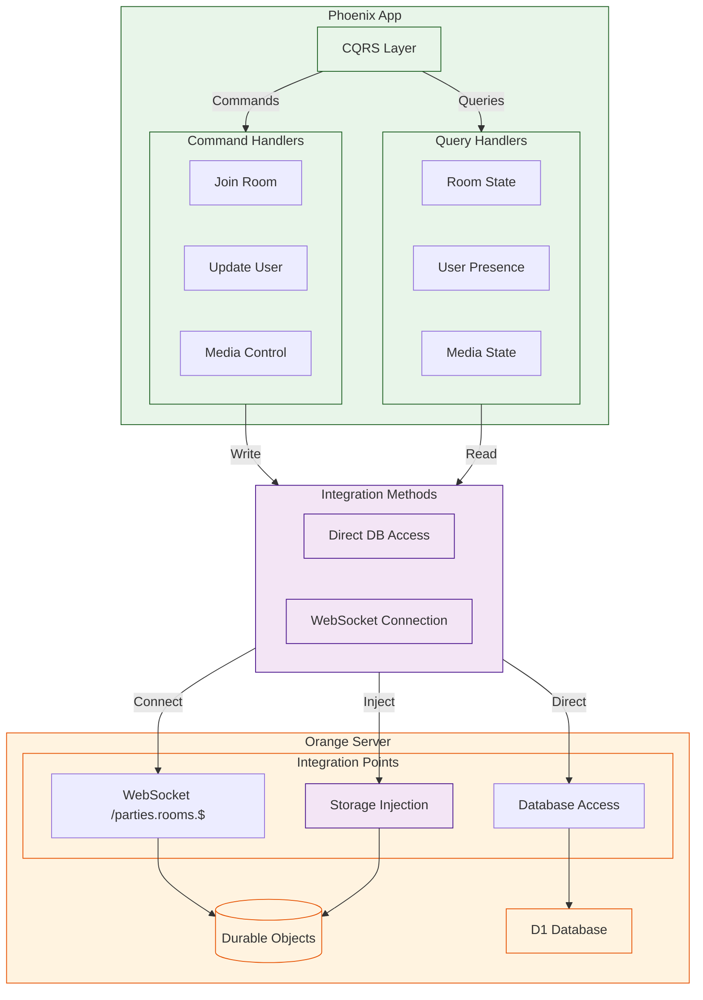
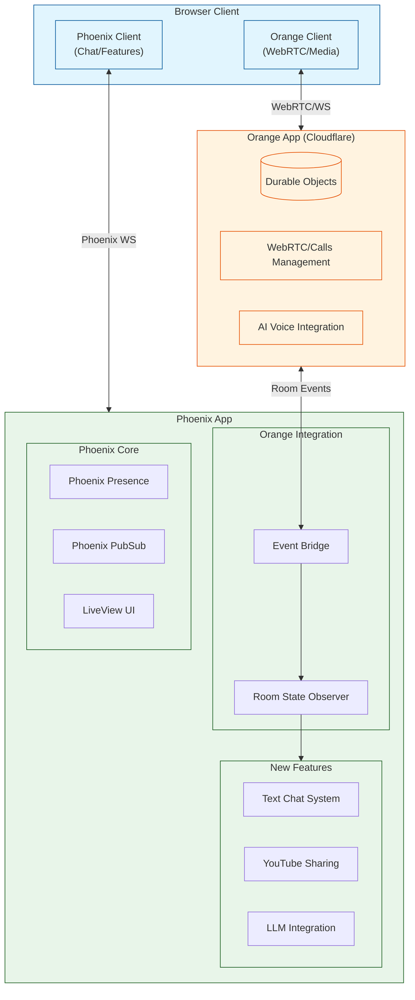
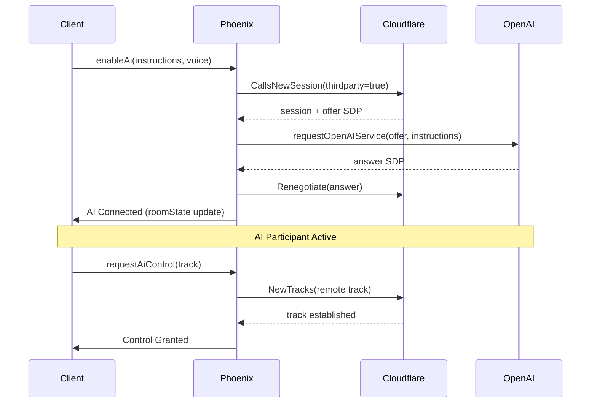
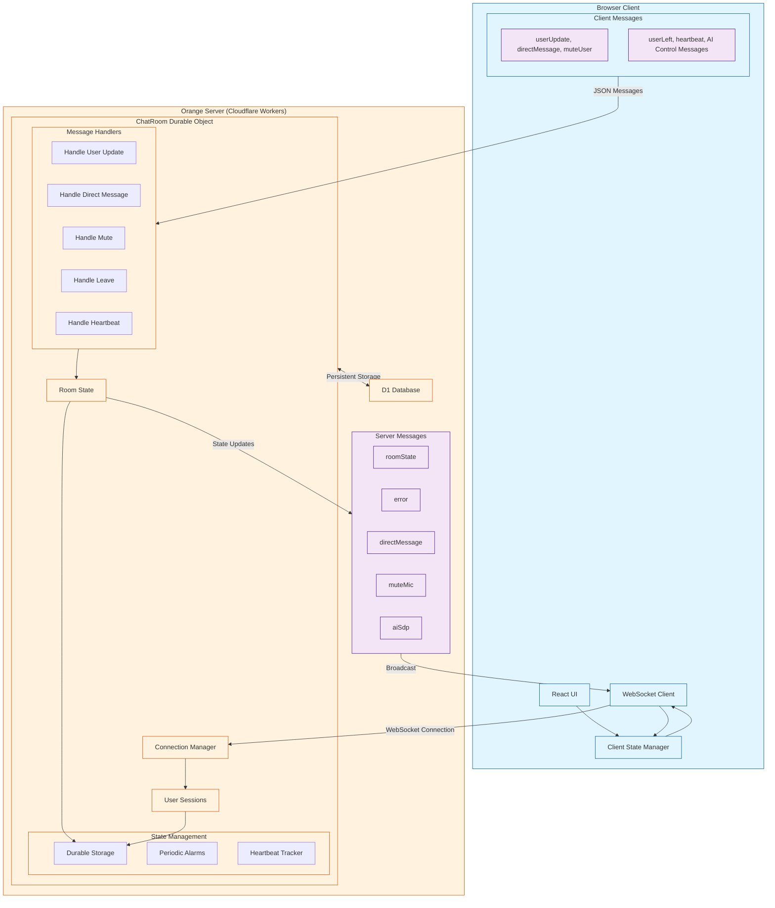

# ExCloudflarePhoenix

**TODO: Add description**

## Installation

If [available in Hex](https://hex.pm/docs/publish), the package can be installed
by adding `ex_cloudflare_phoenix` to your list of dependencies in `mix.exs`:

```elixir
def deps do
  [
    {:ex_cloudflare_phoenix, "~> 0.1.0"}
  ]
end
```

Documentation can be generated with [ExDoc](https://github.com/elixir-lang/ex_doc)
and published on [HexDocs](https://hexdocs.pm). Once published, the docs can
be found at <https://hexdocs.pm/ex_cloudflare_phoenix>.

# Difference from regular Phoenix app

The key differences from a regular Phoenix app are:
1. No web router/endpoint (this is a library)
2. No assets pipeline
3. No Phoenix.PubSub supervisor (left to the host app)
4. Minimal dependencies (only what's needed)

Would you like me to:
1. Show how to set up the test environment?
2. Detail the component organization?
3. Explain the behavior implementations?

# Discussion of integration for libs

```elixir
# Common types and behaviors
defmodule CloudflareInfra do
  @type error_response :: %{
    optional(:error_code) => String.t(),
    optional(:error_description) => String.t()
  }
  
  @callback handle_error(error_response()) :: {:error, term()}
end

# Example usage of both packages
defmodule MyApp.Room do
  alias ExDurableObjects.Room
  alias ExCloudflareCalls.Session
  
  def create_room(room_id) do
    with {:ok, room} <- Room.start_link(room_id),
         {:ok, session} <- Session.new(config(:app_id), config(:secret)),
         :ok <- Room.put(room, "session_id", session.id) do
      {:ok, room}
    end
  end
end

# Start with the protocols
defmodule ExCloudflareCalls.Protocol do
  @callback new_session(map()) :: {:ok, map()} | {:error, term()}
  @callback manage_tracks(map()) :: {:ok, map()} | {:error, term()}
end

defmodule ExDurableObjects.Protocol do
  @callback storage_operation(atom(), term()) :: {:ok, term()} | {:error, term()}
  @callback broadcast_message(term()) :: :ok | {:error, term()}
end

### We have made a first pass at the stubs, look in lib/ex_cloudflare_phoenix.ex
```

# Usage

## In your Phoenix LiveView
defmodule MyAppWeb.RoomLive do
  use MyAppWeb, :live_view
  import ExCloudflarePhoenix.Components
  
  def render(assigns) do
    ~H"""
    <.room room={@room} />
    """
  end
end

# Example Room Implementation
defmodule MyApp.Room do
  use ExCloudflarePhoenix.RoomBehavior
  
  def init(room_id) do
    with {:ok, durable} <- ExCloudflareDurable.Room.start_link(room_id),
         {:ok, calls} <- ExCloudflareCalls.Room.create_room(config()) do
      {:ok, %{durable: durable, calls: calls}}
    end
  end
  
  def handle_join(room, user) do
    # Uses both modules with common patterns
    ExCloudflarePhoenix.Presence.track_user(room.id, user.id, user.meta)
  end
end

# Example LiveView
defmodule MyAppWeb.RoomLive do
  use MyAppWeb, :live_view
  import ExCloudflarePhoenix.Components
  
  def render(assigns) do
    ~H"""
    <.room room={@room} />
    """
  end
end




# Value Propositions:
Reusable LiveView components
Common channel behaviors
Presence integration
Consistent error handling
WebRTC/media patterns
State synchronization

# Package Structure:

ex_cloudflare_phoenix/
├── lib/
│   ├── components/       # Reusable UI components
│   ├── behaviors/        # Common behaviors
│   ├── channels/        # Channel implementations
│   ├── presence/        # Presence integration
│   └── media/          # Media handling
├── priv/
│   └── static/         # Static assets
└── test/
    └── support/        # Test helpers


# Reference concept in CQRS

In my exploration, I proposed an arch that sought to use the CQRS pattern to integrate into the reference Cloudflare Orange Server. I decided instead to go in a different direction, but the abstractions here are useful to help reason about our development direction for our `ex_cloudflare_phoenix` module.



And, here's an even earlier exploration:



Here, I was reasoning about how to integrate the enableAi functionality from the Orange reference app in a new Phoenix project. This was even earlier in my explorations:




Here, we seek to understand the detailed interactions between the ref Orange server's integration with Cloudflare and their ref client:



And, this roughly shows the overall Orange Server arch:

```
graph LR
    subgraph Client["Browser Client"]
        UI["React UI Components"]
        Peer["Peer Manager<br>(Peer.client.ts)"]
        MediaHandling["Media Handling<br>(getUserMedia/Screen Share)"]
        RTCConn["RTCPeerConnection"]
    end

    subgraph Server["Orange Server (Remix)"]
        APIRoutes["API Routes"]
        RoomManager["Room Manager<br>(/_room.$roomName.room)"]
        CallsProxy["Calls Proxy<br>(/api/calls/*)"]
        Auth["Auth/Session Manager"]
        subgraph ServerAPIs["Server APIs"]
            direction LR
            BugReport["/api/bugReport"]
            DeadTrack["/api/deadTrack"]
            DebugInfo["/api/debugInfo"]
            QualityFeedback["/call-quality-feedback"]
        end
    end

    subgraph CloudflareServices["Cloudflare Services"]
        SFU["Cloudflare Calls SFU"]
        STUN["STUN Server<br>stun.cloudflare.com:3478"]
        TURN["TURN Servers"]
        
        subgraph CallsAPI["Calls API Endpoints"]
            Session["Session Management<br>/v1/apps/{appId}/session"]
            Tracks["Track Management<br>/v1/apps/{appId}/tracks"]
            Renegotiate["Renegotiation<br>/v1/apps/{appId}/renegotiate"]
        end
    end

    %% Client to Server Connections
    UI --> |"Room State Updates"| RoomManager
    UI --> |"API Requests"| ServerAPIs
    Peer --> |"Proxied Calls API"| CallsProxy
    
    %% Server to Cloudflare Connections
    CallsProxy --> |"Bearer Auth"| CallsAPI
    
    %% WebRTC Connections
    RTCConn --> |"ICE Candidates"| STUN
    RTCConn --> |"Media Relay"| TURN
    RTCConn --> |"Media Streams"| SFU
    
    %% Internal Client Connections
    UI --> Peer
    Peer --> RTCConn
    MediaHandling --> RTCConn
    
    %% Internal Server Connections
    RoomManager --> Auth
    CallsProxy --> Auth
    
    %% Internal Cloudflare Connections
    Session --> SFU
    Tracks --> SFU
    Renegotiate --> SFU

    classDef client fill:#e1f5fe,stroke:#01579b
    classDef server fill:#e8f5e9,stroke:#1b5e20
    classDef cloudflare fill:#fff3e0,stroke:#e65100
    
    class Client,UI,Peer,MediaHandling,RTCConn client
    class Server,APIRoutes,RoomManager,CallsProxy,Auth,ServerAPIs,BugReport,DeadTrack,DebugInfo,QualityFeedback server
    class CloudflareServices,SFU,STUN,TURN,CallsAPI,Session,Tracks,Renegotiate cloudflare
```