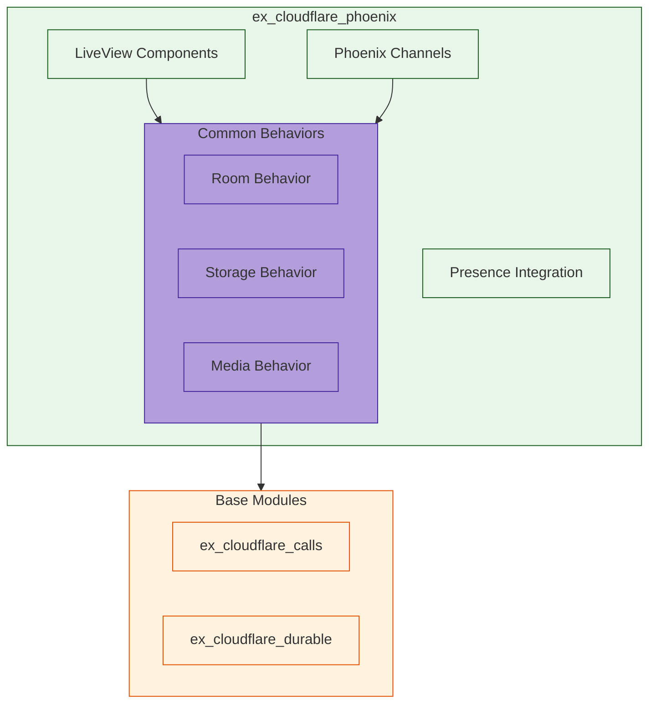

# ExCloudflarePhoenix

**TODO: Add description**

## Installation

If [available in Hex](https://hex.pm/docs/publish), the package can be installed
by adding `ex_cloudflare_phoenix` to your list of dependencies in `mix.exs`:

```elixir
def deps do
  [
    {:ex_cloudflare_phoenix, "~> 0.1.0"}
  ]
end
```

Documentation can be generated with [ExDoc](https://github.com/elixir-lang/ex_doc)
and published on [HexDocs](https://hexdocs.pm). Once published, the docs can
be found at <https://hexdocs.pm/ex_cloudflare_phoenix>.

# Difference from regular Phoenix app

The key differences from a regular Phoenix app are:
1. No web router/endpoint (this is a library)
2. No assets pipeline
3. No Phoenix.PubSub supervisor (left to the host app)
4. Minimal dependencies (only what's needed)

Would you like me to:
1. Show how to set up the test environment?
2. Detail the component organization?
3. Explain the behavior implementations?

# Usage

## In your Phoenix LiveView
defmodule MyAppWeb.RoomLive do
  use MyAppWeb, :live_view
  import ExCloudflarePhoenix.Components
  
  def render(assigns) do
    ~H"""
    <.room room={@room} />
    """
  end
end

# Example Room Implementation
defmodule MyApp.Room do
  use ExCloudflarePhoenix.RoomBehavior
  
  def init(room_id) do
    with {:ok, durable} <- ExCloudflareDurable.Room.start_link(room_id),
         {:ok, calls} <- ExCloudflareCalls.Room.create_room(config()) do
      {:ok, %{durable: durable, calls: calls}}
    end
  end
  
  def handle_join(room, user) do
    # Uses both modules with common patterns
    ExCloudflarePhoenix.Presence.track_user(room.id, user.id, user.meta)
  end
end

# Example LiveView
defmodule MyAppWeb.RoomLive do
  use MyAppWeb, :live_view
  import ExCloudflarePhoenix.Components
  
  def render(assigns) do
    ~H"""
    <.room room={@room} />
    """
  end
end



# Value Propositions:
Reusable LiveView components
Common channel behaviors
Presence integration
Consistent error handling
WebRTC/media patterns
State synchronization

# Package Structure:

ex_cloudflare_phoenix/
├── lib/
│   ├── components/       # Reusable UI components
│   ├── behaviors/        # Common behaviors
│   ├── channels/        # Channel implementations
│   ├── presence/        # Presence integration
│   └── media/          # Media handling
├── priv/
│   └── static/         # Static assets
└── test/
    └── support/        # Test helpers