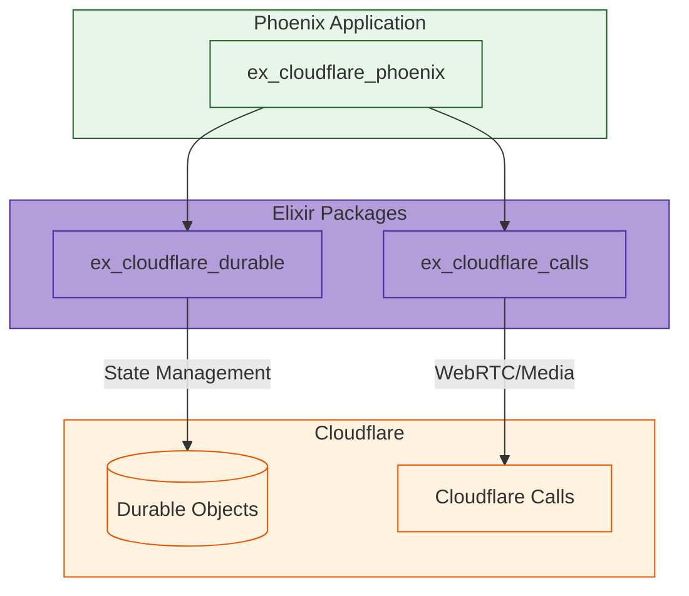
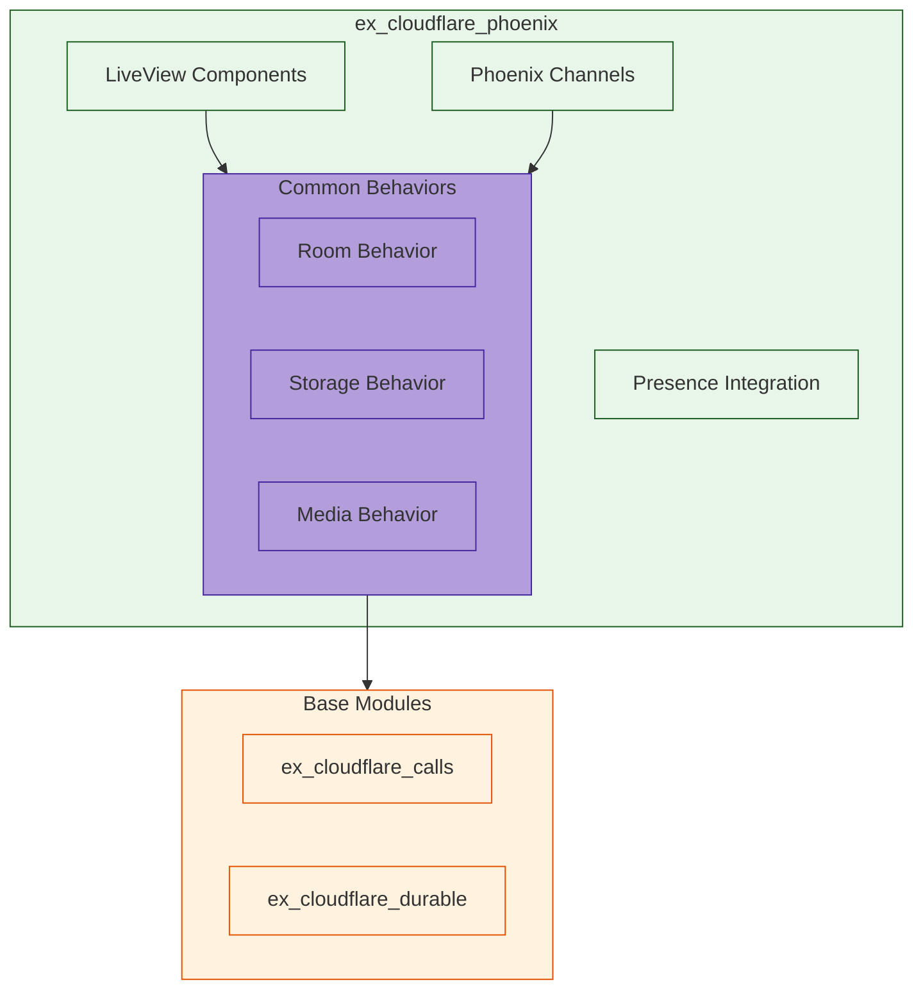
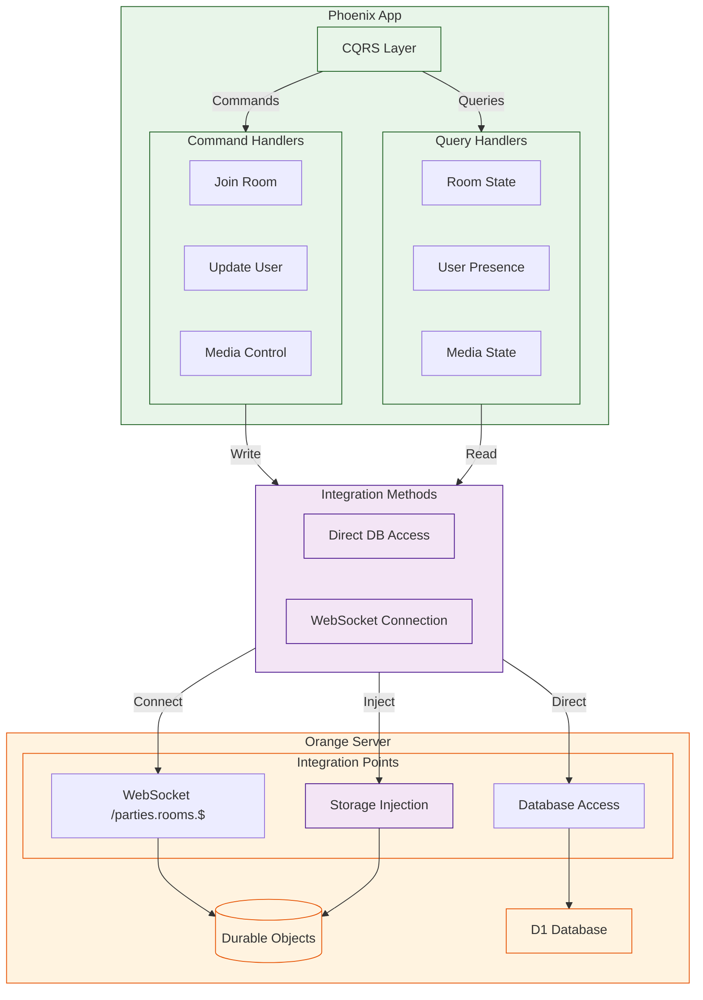
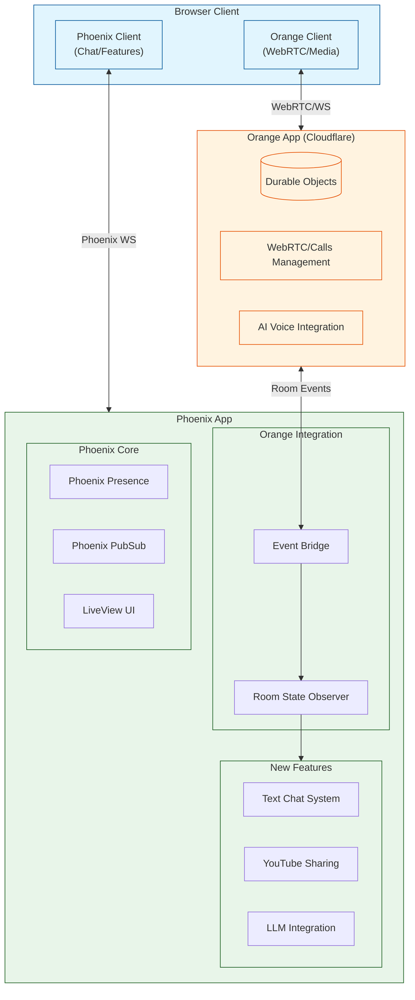
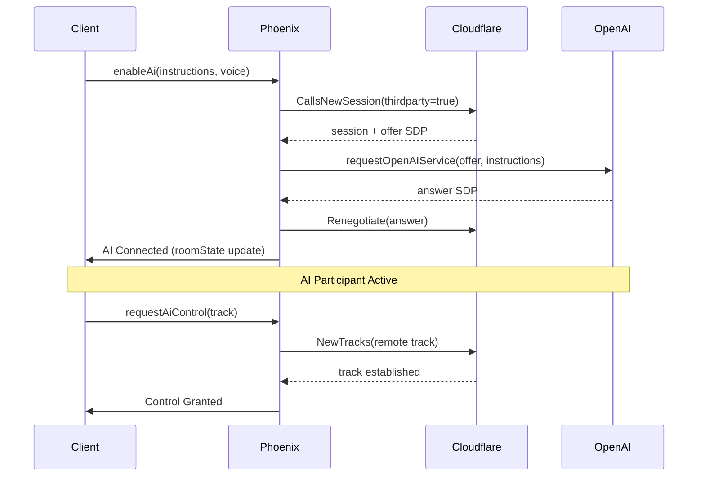
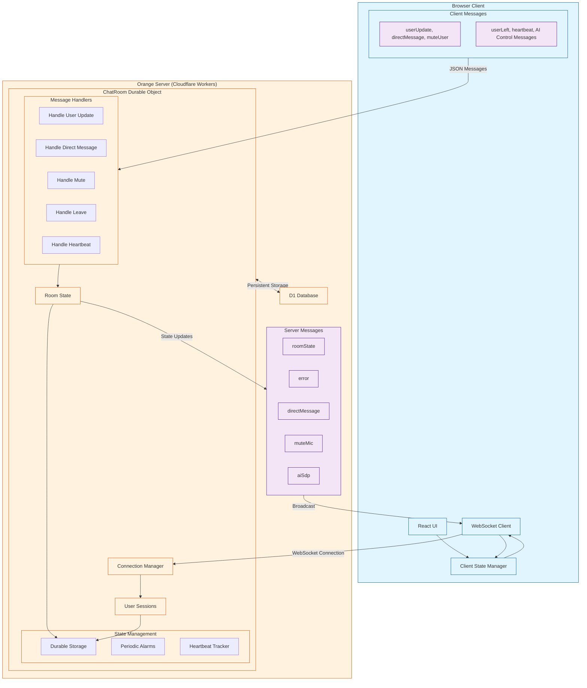

# ExCloudflarePhoenix

**TODO: Add description**

## Installation

If [available in Hex](https://hex.pm/docs/publish), the package can be installed
by adding `ex_cloudflare_phoenix` to your list of dependencies in `mix.exs`:

```elixir
def deps do
  [
    {:ex_cloudflare_phoenix, "~> 0.1.0"}
  ]
end
```

Documentation can be generated with [ExDoc](https://github.com/elixir-lang/ex_doc)
and published on [HexDocs](https://hexdocs.pm). Once published, the docs can
be found at <https://hexdocs.pm/ex_cloudflare_phoenix>.

# Difference from regular Phoenix app

The key differences from a regular Phoenix app are:
1. No web router/endpoint (this is a library)
2. No assets pipeline
3. No Phoenix.PubSub supervisor (left to the host app)
4. Minimal dependencies (only what's needed)

Would you like me to:
1. Show how to set up the test environment?
2. Detail the component organization?
3. Explain the behavior implementations?

# Discussion of integration for libs

```elixir
# Common types and behaviors
defmodule CloudflareInfra do
  @type error_response :: %{
    optional(:error_code) => String.t(),
    optional(:error_description) => String.t()
  }
  
  @callback handle_error(error_response()) :: {:error, term()}
end

# Example usage of both packages
defmodule MyApp.Room do
  alias ExDurableObjects.Room
  alias ExCloudflareCalls.Session
  
  def create_room(room_id) do
    with {:ok, room} <- Room.start_link(room_id),
         {:ok, session} <- Session.new(config(:app_id), config(:secret)),
         :ok <- Room.put(room, "session_id", session.id) do
      {:ok, room}
    end
  end
end

# Start with the protocols
defmodule ExCloudflareCalls.Protocol do
  @callback new_session(map()) :: {:ok, map()} | {:error, term()}
  @callback manage_tracks(map()) :: {:ok, map()} | {:error, term()}
end

defmodule ExDurableObjects.Protocol do
  @callback storage_operation(atom(), term()) :: {:ok, term()} | {:error, term()}
  @callback broadcast_message(term()) :: :ok | {:error, term()}
end

### We have made a first pass at the stubs, look in lib/ex_cloudflare_phoenix.ex
```

# Usage

## In your Phoenix LiveView
defmodule MyAppWeb.RoomLive do
  use MyAppWeb, :live_view
  import ExCloudflarePhoenix.Components
  
  def render(assigns) do
    ~H"""
    <.room room={@room} />
    """
  end
end

# Example Room Implementation
defmodule MyApp.Room do
  use ExCloudflarePhoenix.RoomBehavior
  
  def init(room_id) do
    with {:ok, durable} <- ExCloudflareDurable.Room.start_link(room_id),
         {:ok, calls} <- ExCloudflareCalls.Room.create_room(config()) do
      {:ok, %{durable: durable, calls: calls}}
    end
  end
  
  def handle_join(room, user) do
    # Uses both modules with common patterns
    ExCloudflarePhoenix.Presence.track_user(room.id, user.id, user.meta)
  end
end

# Example LiveView
defmodule MyAppWeb.RoomLive do
  use MyAppWeb, :live_view
  import ExCloudflarePhoenix.Components
  
  def render(assigns) do
    ~H"""
    <.room room={@room} />
    """
  end
end




# Value Propositions:
Reusable LiveView components
Common channel behaviors
Presence integration
Consistent error handling
WebRTC/media patterns
State synchronization

# Package Structure:

ex_cloudflare_phoenix/
├── lib/
│   ├── components/       # Reusable UI components
│   ├── behaviors/        # Common behaviors
│   ├── channels/        # Channel implementations
│   ├── presence/        # Presence integration
│   └── media/          # Media handling
├── priv/
│   └── static/         # Static assets
└── test/
    └── support/        # Test helpers


# Reference concept in CQRS

In my exploration, I proposed an arch that sought to use the CQRS pattern to integrate into the reference Cloudflare Orange Server. I decided instead to go in a different direction, but the abstractions here are useful to help reason about our development direction for our `ex_cloudflare_phoenix` module.



And, here's an even earlier exploration:



Here, I was reasoning about how to integrate the enableAi functionality from the Orange reference app in a new Phoenix project. This was even earlier in my explorations:




Here, we seek to understand the detailed interactions between the ref Orange server's integration with Cloudflare and their ref client:



## Key Components:
ChatRoom Durable Object:
Core state management for each room
Handles WebSocket connections and messages
Maintains user sessions and presence
Implements periodic heartbeat checks
Manages room state broadcasts

## Message Types:
```
// Client -> Server Messages
type ClientMessage = 
  | { type: 'userUpdate', user: User }
  | { type: 'directMessage', to: string, message: string }
  | { type: 'muteUser', id: string }
  | { type: 'userLeft' }
  | { type: 'heartbeat' }
  | { type: 'enableAi', instructions?: string }
  // ... other AI-related messages

// Server -> Client Messages
type ServerMessage = 
  | { type: 'roomState', state: RoomState }
  | { type: 'error', error?: string }
  | { type: 'directMessage', from: string, message: string }
  | { type: 'muteMic' }
  // ... other messages
```

## Room State Structure:
```
type RoomState = {
  meetingId?: string
  users: User[]
  ai: {
    enabled: boolean
    controllingUser?: string
    error?: string
    connectionPending?: boolean
  }
}
```
## Key Features:
Real-time user presence tracking
State synchronization across clients
Heartbeat-based connection monitoring
Support for direct messaging
AI integration capabilities
Mute/unmute functionality

## For Phoenix Port Considerations:

Replace Durable Objects with Phoenix PubSub
Use Phoenix Presence instead of custom presence tracking
Leverage Phoenix Channels for WebSocket handling
Maintain message type compatibility
Implement equivalent state management using Phoenix processes

## WebSocket Communication Layer:
```
// Clean abstraction using PartySocket
const websocket = usePartySocket({
  party: 'rooms',
  room: roomName,
  onMessage: (e) => {
    const message = JSON.parse(e.data) as ServerMessage
    // Type-safe message handling
  }
})
```

## Room State Management:
```
type RoomState = {
  meetingId?: string
  users: User[]
  ai: {
    enabled: boolean
    controllingUser?: string
    error?: string
    connectionPending?: boolean
  }
}
```

## Easy migration points to Phoenix:
```
// Current websocket setup
usePartySocket({
  party: 'rooms',
  room: roomName,
  onMessage: // ...
})

// Can be easily replaced with Phoenix socket:
usePhoenixSocket({
  topic: `room:${roomName}`,
  onMessage: // ... (same message handling)
})
```

## Much earlier attempt to consider how to integrate (deprecated early explorations should now be integrated fully)

### Phoenix Channel Implementation:
```
defmodule MyAppWeb.RoomChannel do
  use MyAppWeb, :channel
  alias Phoenix.Presence

  # Message Types matching Orange protocol
  @type client_message :: 
    %{type: "userUpdate", user: map()} |
    %{type: "directMessage", to: String.t(), message: String.t()} |
    %{type: "userLeft"} |
    %{type: "heartbeat"} |
    %{type: "enableAi", instructions: String.t() | nil}

  @type server_message ::
    %{type: "roomState", state: map()} |
    %{type: "error", error: String.t() | nil} |
    %{type: "directMessage", from: String.t(), message: String.t()} |
    %{type: "muteMic"}

  def join("room:" <> room_name, _params, socket) do
    # Track presence using same user structure as Orange
    {:ok, _} = Presence.track(socket, socket.assigns.user_id, %{
      id: socket.assigns.user_id,
      name: socket.assigns.username,
      joined: true,
      raisedHand: false,
      speaking: false,
      tracks: %{
        audioEnabled: false,
        audioUnavailable: false,
        videoEnabled: false,
        screenShareEnabled: false
      }
    })
    
    {:ok, assign(socket, :room_name, room_name)}
  end

  # Handle same message types as Orange
  def handle_in("userUpdate", %{"user" => user}, socket) do
    Presence.update(socket, socket.assigns.user_id, fn meta -> 
      Map.merge(meta, user)
    end)
    broadcast_room_state(socket)
    {:noreply, socket}
  end

  # Periodic state broadcast (replacing Orange's alarm system)
  def schedule_state_broadcast do
    Process.send_after(self(), :broadcast_state, 15_000)
  end
end
```

### Message Type Mappings:
```
# Orange -> Phoenix Message Mappings
defmodule MyApp.Messages do
  # Client Messages (identical structure to Orange)
  defmodule Client do
    defstruct [:type, :data]
    
    def from_json(%{"type" => "userUpdate"} = msg) do
      # Direct mapping - no transformation needed
      {:ok, msg}
    end
    
    def from_json(%{"type" => "heartbeat"}) do
      # Maps to Phoenix Presence heartbeat
      :heartbeat
    end
  end

  # Server Messages (identical structure to Orange)
  defmodule Server do
    def room_state(state) do
      %{
        type: "roomState",
        state: state
      }
    end

    def error(msg) do
      %{
        type: "error",
        error: msg
      }
    end
  end
end
```

### WebSocket Migration Guide
```
# 1. Socket Connection
defmodule MyAppWeb.UserSocket do
  use Phoenix.Socket
  
  channel "room:*", MyAppWeb.RoomChannel
  
  def connect(%{"token" => token}, socket, _connect_info) do
    # Replace Orange's auth with Phoenix auth
    case verify_token(token) do
      {:ok, user_id} ->
        {:ok, assign(socket, :user_id, user_id)}
      {:error, _} ->
        :error
    end
  end
end

# 2. Presence Handling (replacing Orange's Durable Objects)
defmodule MyAppWeb.Presence do
  use Phoenix.Presence,
    otp_app: :my_app,
    pubsub_server: MyApp.PubSub

  # Track same user state as Orange
  def track_user(socket, user) do
    track(socket, socket.assigns.user_id, %{
      online_at: System.system_time(:second),
      user: user
    })
  end
end

# 3. State Broadcasting (replacing Orange's state updates)
defmodule MyAppWeb.RoomChannel do
  # Broadcast room state in same format as Orange
  def broadcast_room_state(socket) do
    presence_state = Presence.list(socket)
    users = format_users(presence_state)
    
    broadcast!(socket, "roomState", %{
      type: "roomState",
      state: %{
        meetingId: socket.assigns.room_name,
        users: users,
        ai: %{enabled: false} # Match Orange's AI state structure
      }
    })
  end
end
```
## Key Differences and Adaptations:

### State Management:
Orange: Durable Objects
Phoenix: GenServer + Presence
Adaptation: Use Phoenix Presence for distributed state

#### Real-time Updates:
Orange: Custom alarm system
Phoenix: Built-in PubSub
Adaptation: Use Phoenix.PubSub for broadcasts

### Connection Management:
Orange: PartyKit WebSocket
Phoenix: Phoenix Channels
Adaptation: Same message format, different transport

### Authentication:
Orange: Custom auth
Phoenix: Socket authentication
Adaptation: Maintain same user structure

### The client will require only ONE change:

```
// Old (Orange)
const socket = usePartySocket({
  party: 'rooms',
  room: roomName
});
// New (Phoenix)
const socket = usePhoenix({
  endpoint: "/socket",
  topic: `room:${roomName}`
});
```


---


And, this roughly shows the overall Orange Server arch:

```
graph LR
    subgraph Client["Browser Client"]
        UI["React UI Components"]
        Peer["Peer Manager<br>(Peer.client.ts)"]
        MediaHandling["Media Handling<br>(getUserMedia/Screen Share)"]
        RTCConn["RTCPeerConnection"]
    end

    subgraph Server["Orange Server (Remix)"]
        APIRoutes["API Routes"]
        RoomManager["Room Manager<br>(/_room.$roomName.room)"]
        CallsProxy["Calls Proxy<br>(/api/calls/*)"]
        Auth["Auth/Session Manager"]
        subgraph ServerAPIs["Server APIs"]
            direction LR
            BugReport["/api/bugReport"]
            DeadTrack["/api/deadTrack"]
            DebugInfo["/api/debugInfo"]
            QualityFeedback["/call-quality-feedback"]
        end
    end

    subgraph CloudflareServices["Cloudflare Services"]
        SFU["Cloudflare Calls SFU"]
        STUN["STUN Server<br>stun.cloudflare.com:3478"]
        TURN["TURN Servers"]
        
        subgraph CallsAPI["Calls API Endpoints"]
            Session["Session Management<br>/v1/apps/{appId}/session"]
            Tracks["Track Management<br>/v1/apps/{appId}/tracks"]
            Renegotiate["Renegotiation<br>/v1/apps/{appId}/renegotiate"]
        end
    end

    %% Client to Server Connections
    UI --> |"Room State Updates"| RoomManager
    UI --> |"API Requests"| ServerAPIs
    Peer --> |"Proxied Calls API"| CallsProxy
    
    %% Server to Cloudflare Connections
    CallsProxy --> |"Bearer Auth"| CallsAPI
    
    %% WebRTC Connections
    RTCConn --> |"ICE Candidates"| STUN
    RTCConn --> |"Media Relay"| TURN
    RTCConn --> |"Media Streams"| SFU
    
    %% Internal Client Connections
    UI --> Peer
    Peer --> RTCConn
    MediaHandling --> RTCConn
    
    %% Internal Server Connections
    RoomManager --> Auth
    CallsProxy --> Auth
    
    %% Internal Cloudflare Connections
    Session --> SFU
    Tracks --> SFU
    Renegotiate --> SFU

    classDef client fill:#e1f5fe,stroke:#01579b
    classDef server fill:#e8f5e9,stroke:#1b5e20
    classDef cloudflare fill:#fff3e0,stroke:#e65100
    
    class Client,UI,Peer,MediaHandling,RTCConn client
    class Server,APIRoutes,RoomManager,CallsProxy,Auth,ServerAPIs,BugReport,DeadTrack,DebugInfo,QualityFeedback server
    class CloudflareServices,SFU,STUN,TURN,CallsAPI,Session,Tracks,Renegotiate cloudflare
```

Let me break down all the connections:

Orange Server -> Cloudflare Services:
All interactions are RESTful over HTTPS with Bearer token authentication
The server acts as a proxy through /api/calls/* endpoint which forwards to https://rtc.live.cloudflare.com/v1/apps/${appId}
Three main API interactions:
Session Management: POST /v1/apps/${appId}/session
Track Management: POST /v1/apps/${appId}/tracks
Renegotiation: POST /v1/apps/${appId}/renegotiate
Client -> Orange Server:
A. Room Management:

Uses PartyKit for real-time WebSocket connections
Main endpoint: /parties.rooms.$roomName.$
Handles real-time room state, user presence, and synchronization
NOT REST - uses WebSocket protocol for bidirectional communication
B. Calls Proxy:

REST endpoint: /api/calls/*
Acts as a secure proxy between client and Cloudflare
Flow:
Client makes REST call to Orange server's /api/calls/*
Server adds Bearer token auth
Server forwards request to Cloudflare's corresponding endpoint
Response flows back through same path
C. Server APIs (Monitoring/Debug Endpoints): All are REST endpoints:

/api/bugReport:
Handles bug report submissions
Integrates with Google Chat for notifications
Independent reporting endpoint
/api/deadTrack:
Reports WebRTC track failures
Posts to feedback queue
Used for monitoring/debugging
Independent diagnostic endpoint
/api/debugInfo:
Returns debug information about current connections
Used for troubleshooting
Independent diagnostic endpoint
/call-quality-feedback:
Collects user feedback about call quality
Independent feedback collection endpoint
These server APIs are independent monitoring/debugging endpoints that don't directly integrate with the core signaling or media handling logic. They're auxiliary services for operational monitoring and user feedback.

Summary of Connection Types:

WebSocket: Client <-> Orange Server (Room Management)
REST: Client <-> Orange Server (Calls Proxy)
REST: Orange Server <-> Cloudflare Services (All Cloudflare interactions)
REST: Client <-> Orange Server (Monitoring/Debug APIs)
For our Phoenix port, we'll need to:

(THIS MORPHED INTO OUR CURRENT PHOENIX MODULE AND TWO ELIXIR MODULES):
Implement WebSocket handling using Phoenix Channels for room management
Create REST endpoints for the Cloudflare proxy
Recreate the monitoring/debug REST endpoints
Maintain the same authentication and authorization flow