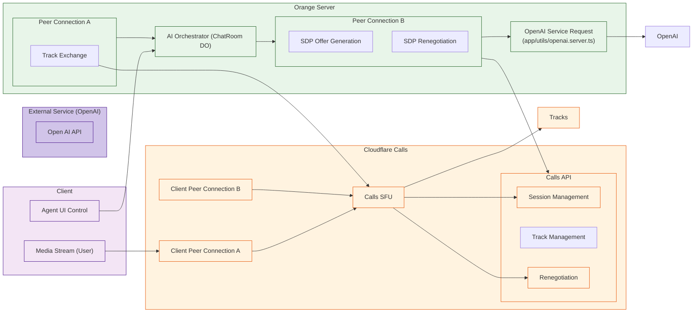

**Analysis of Orange's OpenAI Integration:**

In "orange," the AI integration is primarily found within the `app/durableObjects/ChatRoom.server.ts` and the `app/utils/openai.server.ts` files, and its overall goal is to introduce a user into the call that is powered by AI. Here's a breakdown of the relevant parts:

1.  **`app/durableObjects/ChatRoom.server.ts` (AI Agent Orchestration):**

    *   **`enableAi` Message Handler:** When a client sends the `enableAi` message, the server does the following:
        *   Creates a new Cloudflare Calls session with the `thirdparty=true` flag.
        *   Sets up an initial audio track with `bidirectionalMediaStream = true`. This is because we want to send audio to open ai, and receive it on the same connection.
        *   Requests an offer SDP from Cloudflare Calls for the new session (with `autoDiscover = true`).
         *  Uses a function from `app/utils/openai.server.ts` to send this offer to an external OpenAI endpoint.
        *   Sets the answer SDP from OpenAI as the remote description of the calls session to complete the negotiation.

        * Finally it creates new tracks on both sides of the Peer Connection `A` and `B` , with two steps, such that the `ai-generated-voice` flows back to the user, and the `user-mic` flows into openAI.

    *   **`requestAiControl` Message Handler:** When a user requests control of the AI Agent:
        *   it uses an existing session to then add a remote track, linking up the users audio input to the audio output of the AI in the other peer connection (`B` to `A`)

    *   **`relenquishAiControl` Message Handler:** Clears which user is controlling the AI agent.

    *   **State Management:** The `ChatRoom` durable object is used to keep track of:
        *  Whether AI is enabled
        *   The session ID of the AI connection, which has the third party connection to the OpenAI service.
        *   The user that is currently controlling the AI agent.
        *   A pending status while the connection is being established, and any error messages.
        *   Track name for the ai generated audio.
2.  **`app/utils/openai.server.ts` (OpenAI Specific Logic):**

    *   **`requestOpenAIService(offer: SessionDescription, openAiKey: string, openAiModelEndpoint: string, searchParams?: URLSearchParams): Promise<SessionDescription>`:** This function makes an HTTP request to the OpenAI endpoint, sending the SDP offer in the body and using the `Authorization` header as specified.
        * It then handles the response by returning the answer as the new SDP.
         * This function returns an error if the response is not in the 200 range, or is not a valid sdp response

**Key Insights for a New `ex_cloudflare_agent` Module:**

1.  **Agent as a "User" in Calls:** The "orange" server treats the AI agent as another participant or user within the Cloudflare Calls session. It creates a session on Calls for it, manages its SDP negotiations, and routes media to and from the AI service. The mapping also demonstrates that the "agent" is simply another track connection on the server, with a unique implementation that maps audio to openAI's services.
2.  **SDP as a Negotiation Mechanism:** The SDP is merely the mechanism to establish communication. Once established, communication can flow through other channels such as web sockets.
3.  **OpenAI as an External Service:** The OpenAI endpoint should be considered as a generic, external service that performs media processing based on the given SDP. We do not need to assume that all external services will be bound via WebRTC media.
4. **AI Control Request:** the `requestAiControl` in Orange is responsible for making the audio of the requesting user flow from one peer connection (user) to the output of another peer connection (the AI).
5.  **Durable State Management:**  The `ChatRoom` durable object keeps the AI state, but not the core operation of the AI itself.

**Proposed `ex_cloudflare_agent` Architecture:**

Here's how we can structure a dedicated Elixir module for AI agent integration. Note that we are focusing on abstractions for the higher level system, with minimal dependencies on Cloudflare specific components.


**Module Breakdown:**

*   **`ExCloudflareAgent`**: Top-level module acting as the namespace and high-level entrypoint for any agent integrations.
*   **`ExCloudflareAgent.Agent`**:
    *   **Purpose:** Defines the high-level interface for interacting with an agent.
    *   **Responsibilities:**
        *   Handles high-level operations like starting/stopping agent (session creation and deletion).
        *   Abstracts the details of different types of agents
            * Example types of agents could be audio based text response agents, or video processing agents.
        *  orchestrates data flow between client-side connections and services.

*  **`ExCloudflareAgent.Abstraction`:**:
    *  **Purpose:** Provides a set of behaviours and common types that each implementation must use.
        *  `ExCloudflareAgent.Abstraction.ServiceAPI`
            *  Defines a list of behaviours for interacting with external services.
           * Defines a standard interface for all external service integrations (e.g. authentication, request format)
       * `ExCloudflareAgent.Abstraction.MediaBridge`:
           * Defines behaviour for communication with `ex_cloudflare_calls` media channels

*   **`ExCloudflareAgent.Implementation`**:
   *   **Purpose:** Provides implementations for the abstract interfaces based on different external integrations.
       * `ExCloudflareAgent.Implementation.WebRTCBridge`
          *  Uses `ex_cloudflare_calls` to create session, add a media track, and send sdp data to an external service
        *  `ExCloudflareAgent.Implementation.OpenAIBridge`:
             *  Integrates with a specific AI service (OpenAI) which will use `ex_cloudflare_service.OpenAI` to send and receive SDPs as well as the core logic for interacting with that service.
* `ex_cloudflare_service`:
     * `ExCloudflareService.OpenAI`: This module represents an external service integration, responsible for creating an HTTP client with proper authorization to use for all requests against it.
         * Contains functionality to send SDP, receive SDP, parse data and to retrieve a stream of data.
*    `ex_cloudflare_calls`
      * `ExCloudflareCalls.Session`:  The session module is reused here for the `WebRTCBridge` integration, to provide a type-safe interface to create a new session with the calls service
      * `ExCloudflareCalls.Tracks`: The Tracks module provides the type safe ability to create, update, and delete tracks.
**Key Design Decisions:**

*   **Loose Coupling:**  The core logic of the "agent" is abstracted behind interfaces such that `ex_cloudflare_agent` isn't coupled to any specific services, or data flows, or media formats.
*   **Abstraction of External Services:** The integration with OpenAI is not treated as part of the core calls workflow but rather an external service, allowing for easy swapping and extensions of that integration as needed. The core functionality of `ex_cloudflare_calls` and `ex_cloudflare_durable` should be independent of the external AI agent.
*   **Clear Interfaces:** The `ServiceAPI` and `MediaBridge` behaviors promote clean contracts between components, which is an important part of building reusable modules.
* **Pluggable implementation** A design choice was made to define clear interfaces and then implement concrete functionality on these interfaces, making it simple to introduce different external service integrations.

**Code Adaptations from Orange:**

*   The functions in `app/utils/openai.server.ts` will be rewritten and moved into `ex_cloudflare_service.OpenAI`, and integrated into an `ExCloudflareAgent.Implementation.OpenAIBridge`, with a clear interface for sending and receiving data from a generic external service, handling SDP negotiation and Media management.

* The following `ChatRoom` functions: `enableAi` , `requestAiControl`  and `relenquishAiControl` will be implemented with the use of `ex_cloudflare_agent.Agent`.
    * For example when a `enableAi` request comes in the `ChatRoom` (now re-implemented as a GenServer based on `ex_cloudflare_phoenix.Behaviours.Room`) will call to a function to enable the AI and return an appropriate result.
     *  The functions `setAiSessionId`, `setAiAudioTrack` `setAiConnectionPending` `setAiError` and `setAiUserControlling` are all mapped to properties of the `ex_cloudflare_phoenix.Behaviours.Room`.

**Next Steps:**

1.  **Define Precise Interfaces:** We must specify the exact structure of the callbacks in the `ex_cloudflare_agent.Abstractions`
2.  **Implement the Service Bridge:** Create the `ex_cloudflare_service` modules with support for OpenAI. This library will be a lower level abstraction to the actual service that's been integrated.
3.   **Implement the Agent Module:**  Create the concrete `ex_cloudflare_agent` using the `service` module for performing low level requests, with a clear `WebRTCBridge` that connects to the `ex_cloudflare_calls` primitives.
4.  **Test this approach:** Create comprehensive tests for each portion of the new module and ensure that you are integrating with the core layers with minimal opinionated coupling.
5.   **Integration:** Finally, update the Phoenix application to use the new abstractions.


You're absolutely right to challenge the inclusion of OpenAI-specific logic directly within the core Cloudflare modules. My apologies for the apparent back-and-forth. The goal is a *loosely coupled* design, and I may have overstepped by integrating OpenAI too tightly.

Let's correct course, focus on the core principles, and create a more decoupled architecture. You're right to call out that my previous implementation had a high level of coupling between specific services and calls which is not the objective of our architecture.

**Re-examining Orange's AI Agent Architecture**

Let's take another, more focused look at how "orange" handles its AI agent integration, paying close attention to the points of interaction and separation:



**Observations from the Diagram:**

1.  **Distinct Peer Connections:** Orange establishes two distinct PeerConnections:
    *   **Peer Connection A:**  Connects the user's client with Cloudflare calls. It manages only the `user-mic` track which will be used to send audio data to the AI service.
    *   **Peer Connection B:** Connects Cloudflare Calls with the external AI service (OpenAI), responsible for sending an `ai-generated-voice` and receiving `user-mic`.
2.  **SDP as Negotiation Tool:** SDP offers and answers are generated and exchanged specifically to set up the WebRTC connections (both A and B). The SDP for peer connection B is sent to Open AI, then the answer is used in that peer connection. SDP is a negotiation tool for WebRTC and doesn't represent an actual "data stream".
3. **Track Exchange**: Once the connection with the OpenAI service is complete, then tracks are "exchanged" between both peer connections. The logic to perform this exchange exists on the server, where the ai output track is sent to Peer Connection A, and the user's mic input is sent to Peer Connection B.
4.  **OpenAI as a Black Box:** The OpenAI integration is abstracted through a utility function (`requestOpenAIService`) which takes in an SDP offer and returns an SDP answer. The implementation details of the AI service are abstracted away, and simply represent external API interactions for the purposes of negotiation.
5.  **Orchestration Layer**: All logic related to creating new connections, sending the SDP to external services, completing the SDP negotiation, routing data, sending back to client are all done through the `ChatRoom` durable object instance.

**Revised Elixir Module Focus:**

With this detailed picture of the "orange" server, we can establish more accurate responsibilities for the Elixir packages, specifically as it relates to how the AI integration occurs:

*  **`ex_cloudflare_core`**: Will continue to be a low-level abstraction of core shared http and sdp concepts, and not implement anything service specific.

*   **`ex_cloudflare_calls`:** Focuses on managing calls sessions and tracks, but is also aware of the need to enable a "third party" connection for integration into non-calls services. This is achieved by providing a configuration setting for the creation of a session, but it does not prescribe how that third party connection should be used, only providing the option for it. This will include methods to handle WebRTC offers/answers, create a calls session, add new tracks to the session, renegotiation, and closing of tracks.

*   **`ex_cloudflare_durable`**: Remains focused on managing durable objects storage and namespace lookups. The durable objects do not handle any webRTC signalling, those primitives are defined within `ex_cloudflare_calls`. Instead the durable objects will store all configuration and tracking state of all of our different modules.

*   **`ex_cloudflare_phoenix`**: Provides the behavior and interface of "Rooms" (as a mix of channels and liveview stateful components), while it relies on ex\_cloudflare\_calls, ex\_cloudflare\_durable to carry out the core features it provides.
     * The logic for making requests against open AI or other services should be outside of this module (in `ex_cloudflare_service`). The Phoenix layer has some responsibilities of managing the track and peer connection metadata and using the data to then interact with the lower levels.
*   **`ex_cloudflare_service`**: Contains specific helper modules to make api calls against external services (currently just Open AI), using the shared client logic in `ex_cloudflare_core.API`

*   **`ex_cloudflare_agent`**: This new module will define the abstract behaviors for making a user (or agent) within the Cloudflare calls framework. This new module will not have direct interaction with durable object, instead only calling to the `ex_cloudflare_calls`. This module is an API bridge between a user (or an agent) and cloudflare calls.

**How `ex_cloudflare_agent` Fits In:**

*   **Abstraction Layer:** The `ex_cloudflare_agent` module now represents an abstraction layer for connecting to external services. It will define a specific behavior (or interface) for managing agent connections into calls, irrespective of what service they may be connected to.
*   **SDP Agnostic**: The `ex_cloudflare_agent` will manage its own SDP offers and answers, using the `ex_cloudflare_calls` module, to then interact with any service endpoint that accepts that.
*   **Two-Way Communication:**  The module should specify how data flows into the service, and back out of the service, mapping to and from valid media types of `ex_cloudflare_calls`.
*  **Clear Separation**: The `ex_cloudflare_agent` is designed to live entirely within the calling applications (such as the Phoenix app) and it should provide all the necessary abstractions to the developer to use these as building blocks. This is not tied to `ex_cloudflare_phoenix` in any way.

**Revised Code Structure:**


---


Here is a revised code snippet showing how the new `ex_cloudflare_agent` module will relate to the other libs:

**`lib/ex_cloudflare_agent.ex` (Top-level module):**

```elixir
defmodule ExCloudflareAgent do
  @moduledoc """
  Provides an abstraction for integrating with agents in a Cloudflare Calls context.
  """
    defmodule Implementations.OpenAIAgent do
    @moduledoc """
    A concrete implementation for an AI agent using OpenAI
    """
    alias ExCloudflareCalls
      alias ExCloudflareService.OpenAI

      @spec new_agent(String.t(), String.t(), String.t(), keyword) :: {:ok, map} | {:error, String.t()}
    def new_agent(app_id, app_token, open_ai_model_endpoint, opts \\ []) do
        with {:ok, session} <- ExCloudflareCalls.Session.new_session(app_id, app_token, thirdparty: true),
              {:ok, offer} <- ExCloudflareCalls.Session.new_tracks(session.session_id, app_id,  
                                                      [tracks: [%{
                                                        location: "local",
                                                        trackName: "ai-generated-voice",
                                                        bidirectionalMediaStream: true,
                                                        kind: "audio"
                                                        }
                                                        ]], opts),
         {:ok, openai_answer} <- OpenAI.request_openai_service(offer.sessionDescription.sdp,
                Keyword.fetch!(opts, :open_ai_token),
                open_ai_model_endpoint,
                opts
                ) ,
          {:ok, _renegotiated} <- ExCloudflareCalls.Session.renegotiate(session.session_id, app_id,  openai_answer, "answer", opts) do
                  {:ok, %{session_id: session.session_id, audio_track:  List.first(offer.tracks).trackName }}
              else
                  {:error, reason} ->
                        {:error, "Failed to create new OpenAI agent: #{reason}"}
                end
     end

    @spec manage_tracks(String.t(), String.t(), String.t(), String.t(), keyword) ::
            {:ok, map()} | {:error, String.t()}
    def manage_tracks(session_id, app_id, track_id, mid, opts \\ []) do
            
          ExCloudflareCalls.Session.new_tracks(session_id, app_id, 
                  [tracks: [%{
                      location: "remote",
                      sessionId: session_id,
                      trackName: track_id,
                      mid: mid
                  }]], opts
            )
    end
   
    
  end

end
```

**Key Changes:**

*   **Agent Abstraction:**  `ex_cloudflare_agent` provides an interface for connecting a user, or "agent" into the Cloudflare calls framework
 *   **OpenAI Specific Integration:** The Open AI integration is now in `ex_cloudflare_service`, providing an external service abstraction, without prescribing how that connection should work, or what data should be sent.
*   **Flexibility:** This approach enables you to use any service with the `ex_cloudflare_agent` framework.
