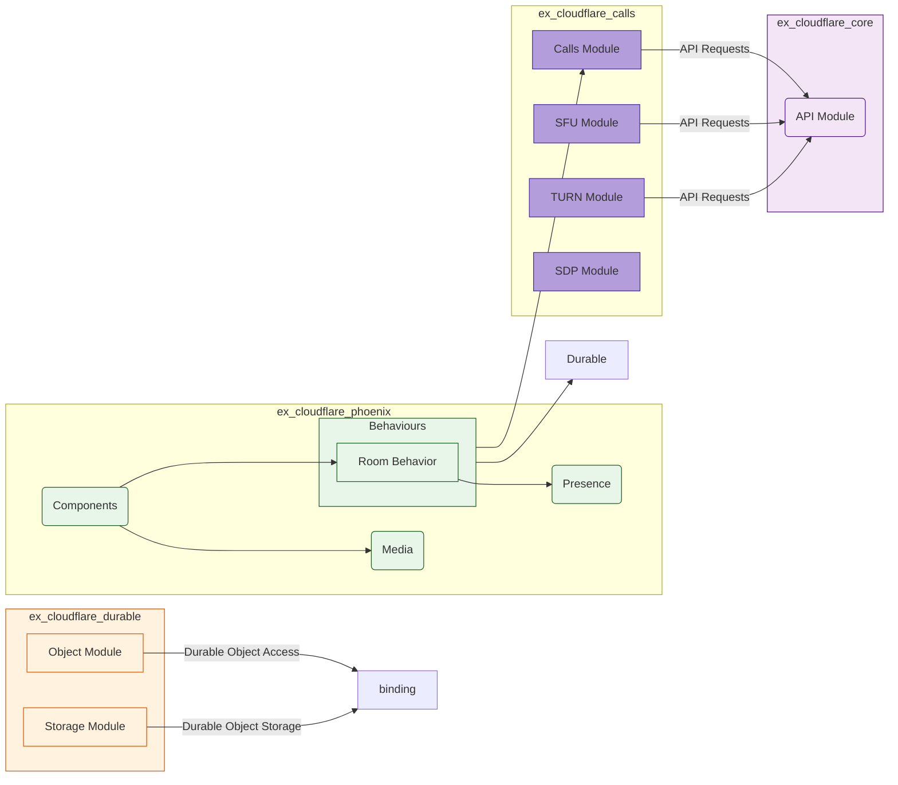
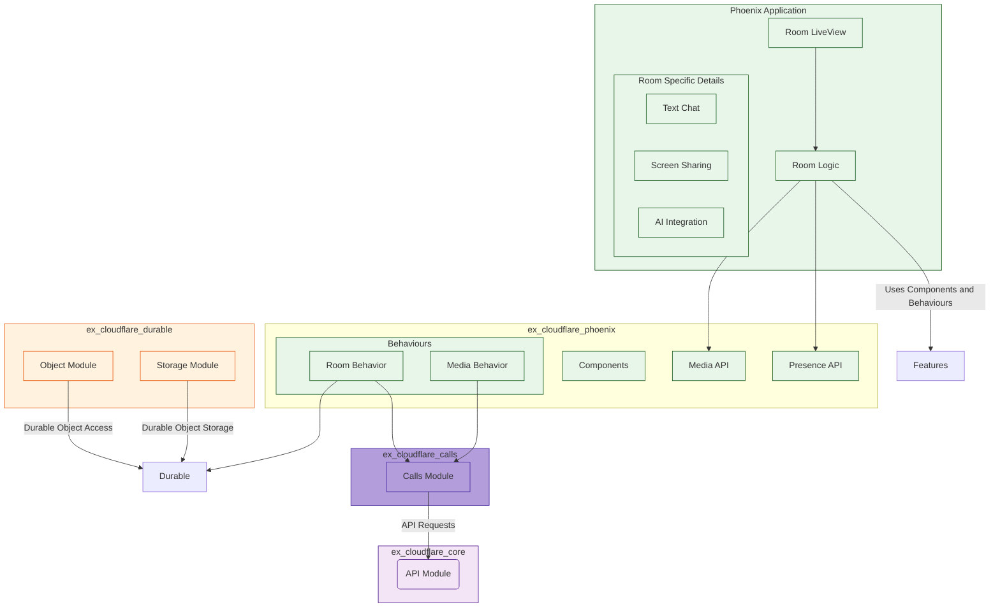

Let's visualize the structure of `ex_cloudflare_phoenix` and its integration with both the core Elixir packages, and how a consumer application will leverage all three packages together.

**1. `ex_cloudflare_phoenix` Architecture & Integration:**

**Discussion:**

This diagram illustrates how `ex_cloudflare_phoenix` integrates with the lower-level packages (`ex_cloudflare_core`, `ex_cloudflare_calls`, and `ex_cloudflare_durable`), alongside showcasing the different responsibilities within `ex_cloudflare_phoenix`:

*   **`ex_cloudflare_phoenix`**: This is the top-level module, acting as a facade, bringing together different abstractions into a coherent whole.
*  **`Components`:** This module contains all of the LiveView components, such as the `room`, `media_grid`, or any other re-usable UI component.
*   **`Behaviours`:** The `RoomBehavior` module defines the callback functions for defining a room lifecycle within a phoenix process and this is used by any specific implementation of a room.
*   **`Presence`:** This module integrates the room level process with the Phoenix.Presence subsystem.
*   **`Media`:** This manages the configuration of media using the low level calls api, implementing the logic to set up and configure media tracks based on the type of `RoomBehaviour` used.

* The `ExCloudflareCore` box contains the shared API module that is used in all modules that require http communication.

*   The `ex_cloudflare_calls` box represents the low-level calls api module with session, turn, sfu, and sdp specific modules that perform low level operations on the calls api.

*   The `ex_cloudflare_durable` box represents the low-level durable object api module with storage and object specific modules that manage access to specific durable objects.

The diagram highlights the following points:

*   **Composition:**  `ex_cloudflare_phoenix` composes abstractions from different lower level projects and is a higher level concept.
*   **Clear Interfaces:** Phoenix specific concerns are managed inside this package with clean integration points with the core APIs.
*   **Flexibility:**  The behaviors promote composable state management logic that can be extended or customized on a case by case basis, enabling usage beyond just the reference architecture.

**2. Usage Example in a Phoenix Application:**

**Discussion:**

This diagram shows how a hypothetical Phoenix application would use the `ex_cloudflare_phoenix` package, emphasizing the flow of control and responsibilities within that application:

*  `Phoenix App` The top-level abstraction is a "Phoenix Application", which represents the final web application built using the framework, which also integrates with cloudflare via the various packages we are building.

* `Room LiveView`: This is a specific page view within the Phoenix application that implements a specific integration for a type of Cloudflare Calls room, or durable object. The liveview renders reusable components to build out a user experience. This component implements a `RoomModule` to manage state, and also to orchestrate communication with other services.

*  `RoomModule` Uses the behaviors from `ex_cloudflare_phoenix`, such as `RoomBehaviour` to model room level functionality. This module also integrates with `ex_cloudflare_core`, `ex_cloudflare_calls`, `ex_cloudflare_durable` and the `ex_cloudflare_service` layer (not depicted here). This also implements other functions specific to this room as well.

*  `Room Specific Details`: Each specific room has its unique requirements for handling text chat, AI integration, and screensharing.

*   **`ex_cloudflare_phoenix`:** This acts as the intermediary, providing reusable building blocks to our Phoenix Application, integrating deeply with Phoenix as it provides LiveView components for presentation, Phoenix Channels for websocket integration, Presence for user tracking, and behaviors to enable a developer to build highly specialized integrations with a consistent approach.
*   **`ex_cloudflare_core`**, **`ex_cloudflare_calls`**, and **`ex_cloudflare_durable`**: These modules are leveraged by the `ex_cloudflare_phoenix` and act as a layer that abstracts the complexities of each individual service within Cloudflare and its underlying http interfaces.
*  **`ex_cloudflare_service`** This integration package provides a clear way for the Phoenix application to integrate with external APIs, such as those needed for AI, user directory etc.

