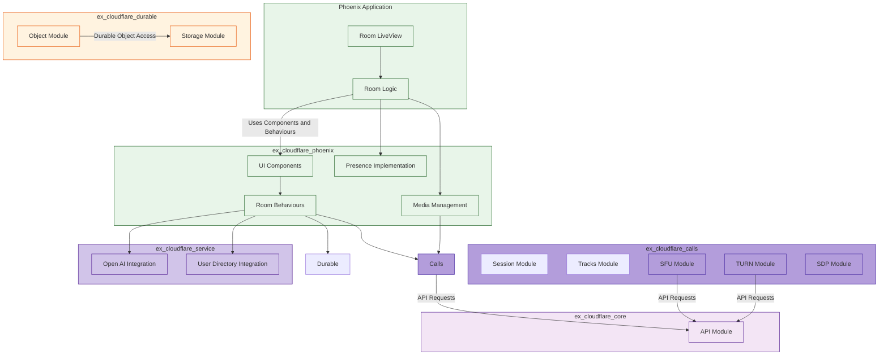

**Expanded Mapping Summary with Detailed Analysis:**

Here's the expanded mapping, going beyond the surface-level connections to highlight how specific functions and concepts in Orange translate to our Elixir architecture:

1.  **`server.ts` (Main Worker Entry Point):**

    *   **`fetch(request: Request, env: Env, ctx: ExecutionContext): Promise<Response>`:** This is the top-level request handler in the Cloudflare Worker, and also manages the Durable object and message queue binding to the environment.
        *   **Elixir Mapping:**
            *   The core routing functionality (handling `/ingest` and `/play` paths and deciding between static assets or Remix application is entirely within the Phoenix application. The separation is done by path.

            * The `env` is resolved at the Phoenix application level and passed down to lower levels.
            * durable object namespaces are fetched using `ex_cloudflare_durable.Object.get_namespace`.
                * the `env` variable is used in the function arguments to allow developers to get the DO bind name.
            *  message queues are integrated inside `ex_cloudflare_service`.
            *  The `createKvAssetHandler` will stay within the phoenix server entry point
    *   **Code Flow Mapping:**
        1.  The incoming request is received by the Phoenix application.
        2.  Phoenix router is used to parse the url and perform matching against known routes.
        3.  Based on the route, either a normal view is rendered, or a websocket connection will be initialized and passed into the appropriate `ex_cloudflare_phoenix.Behaviours.Room`.
        4. The Liveview, or the Phoenix Channel (or both) uses helper modules to make calls against `ex_cloudflare_calls` and or `ex_cloudflare_durable` and `ex_cloudflare_service` where necessary.

2.  **`app/durableObjects/ChatRoom.server.ts` (Durable Object Logic):**

    *   **Purpose:** Manages the state of a single chat room, handles WebSocket connections, user presence, message broadcasting and AI integration.
    *   **Mapping:**
        *   **`constructor(ctx: DurableObjectState, env: Env)`:** Maps to the initialisation of the `GenServer` defined via the `ex_cloudflare_phoenix.Behaviours.Room`.
            *   The durable object storage (ctx.storage) is passed into the GenServer in a structured format.
        *   **`onStart(): Promise<void>`:**  This could be seen as setting up a timer to track users. The `ex_cloudflare_phoenix.Behaviours.Room` will implement this through  `Process.send_after` to manage the periodic "heartbeat" message. This is triggered after the channel `join/3` function is executed.

        *   **`onConnect(connection: Connection<User>, ctx: ConnectionContext): Promise<void>`:** Mapped to a combination of the `join/3` function from `ex_cloudflare_phoenix.Behaviours.Room`, and the `track_user` call using `ex_cloudflare_phoenix.Presence`.
            *  `ex_cloudflare_durable` can be called from here to persist the state of users in durable storage.
        *   **`trackPeakUserCount()`:** This method uses durable object storage to implement the functionality of tracking the peak user counts. This will map to a function defined inside of our `ex_cloudflare_phoenix.Behaviours.Room`, which internally will make the calls against `ex_cloudflare_durable.Storage`.
        *   **`broadcastRoomState()`:** Translated into `ex_cloudflare_phoenix.Behaviours.Room` which will use `Phoenix.Channel.broadcast` to send messages to all clients via a topic that correlates to a particular room name. Additionally this function should also interact with `ex_cloudflare_durable` to track the current state of the room (for persistence).
        *   **`onClose(connection: Connection, code: number, reason: string, wasClean: boolean)`:** In our Elixir framework, this is mapped to `handle_leave` defined as a callback in the `ex_cloudflare_phoenix.Behaviours.Room`.
        *   **`onMessage(connection: Connection<User>, message: WSMessage): Promise<void>`:** Maps to `handle_in/3` in the Phoenix Channel behavior, that then uses a case statement to handle the different client message types (`userLeft`, `userUpdate`, `directMessage`, etc).  These handlers in turn use functions defined in the core API and durable object layer to carry out core operations. These are also then passed to the callback defined for the room in `ex_cloudflare_phoenix.Behaviours.Room`.
            *  This is where the main functionality of receiving client messages are implemented.
        *   **`onError(connection: Connection, error: unknown): void | Promise<void>`:** This is a callback that we will provide that allows to perform side effects when encountering an error in a socket.

        * **`getUsers()`**: Maps to a `Presence.list/1` to return all current user data connected.

        *   **`endMeeting(meetingId: string)`:**  This method is mapped to a specific function in our `ex_cloudflare_phoenix.Behaviours.Room` that can be triggered by a client (or a timer process) that deletes the persisted information stored within `ex_cloudflare_durable`

        *   **`cleanupOldConnections()`:** This maps to a periodic check we'll implement in a `handle_info/2` that cleans up timed out user sessions.

        * **`alarm(): Promise<void>`**: This maps to a periodic action defined in `ex_cloudflare_phoenix.Behaviours.Room` using `Process.send_after`.

     *  **Code Mapping Details:**
         * We'll use pattern matching in Elixir to parse each type of message and branch to different internal handlers.
        * We use functional composition (pipelining) to structure the execution of each stage.
         * For async operations (e.g. API calls), we'll be using `Task` to avoid blocking calls and manage concurrency.
        * `Phoenix.Presence.track`, `Phoenix.Presence.update`, `Phoenix.Presence.list` are used to manage the state of connected users.

3.  **`app/queue.ts`:**

    *   **Purpose:** Handles message processing from Cloudflare Queues, mainly used for reporting feedback.
    *   **Mapping:**
        *   The core `queue` function will be translated to a function within `ex_cloudflare_service.Queue`, receiving a payload and a configured `FEEDBACK_URL`.
        *   The retry functionality is now abstracted within the core HTTP call function (`ex_cloudflare_core.API`).
    *   **Code Mapping Details**:
        * Use Elixir Task for the message handling to ensure no blocking execution.
        * Use `HTTPoison` for making the necessary HTTP request to the `FEEDBACK_URL`

4.  **`app/utils/openai.server.ts`:**

    *   **Purpose:** Handles the interaction with the OpenAI API. It sends SDP offers to Open AI and sets the answer to the corresponding peer connection.
    *   **Mapping:**
        *   The `CallsNewSession` function, which has a `thirdparty` flag, has been decomposed into two separate calls:
            *  `ex_cloudflare_calls.Session.new_session/2` which is the low level abstraction of calling the calls service.
         *  and if `thirdparty=true`, then a second call will be made in `ex_cloudflare_service.OpenAI` to handle the open ai specific use cases, after creating a new session on calls.
        *  `Renegotiate` function is mapped directly to `ex_cloudflare_calls.Session.renegotiate`.
        * `requestOpenAIService`  is directly mapped to `ex_cloudflare_service.OpenAI.request_openai_service`

    *   **Code Mapping Details**:
        *   The request to Open AI will be done with `httpoison`, while providing the correct headers and body as defined by its interface.
        *   Error handling will be managed using Elixir's pattern matching and `with` statements to catch http errors and transform them to elixir domain specific error values.

5.  **`app/utils/getUserMedia.ts`, `app/utils/rxjs/*`, `app/utils/ewma.ts`:**

    *   **Purpose:**  Provides utilities to acquire and monitor user's media devices as well as providing abstractions to WebRTC data reporting.
    *   **Mapping:**
        *   The device list discovery will occur at the LiveView level via a set of helpers to use `navigator.mediaDevices`
        *   Data monitoring for available bit rate and packet loss are now built in and provided as streams via observables. This means that it's up to the Phoenix application to use them in the client to provide visual or other feedback. `ex_cloudflare_phoenix` will not have any specific opinion about this implementation other than it expects a valid set of data to pass to the client.
        *  The device prioritization will also be kept at the client (LiveView/React Hook) level, but the API calls needed for those device calls will be in `ex_cloudflare_phoenix.Media`, and used only in the media abstraction.
    *    **Code Mapping Details**:
         * Functional paradigms with Elixir libraries `Enum`, `Stream`, `Task` and `Agent` will be used.

6.  **`app/utils/callsTypes.ts`:**
    *   **Purpose:** Defines the types used across the calls API implementation.
    *   **Mapping:**
        *   These types will be mapped to Elixir typespecs within the respective modules (`ex_cloudflare_core`, `ex_cloudflare_calls`, and `ex_cloudflare_phoenix`), creating type-safe function interfaces.

**"Misc" - External Service Integration (AI Agent Bridge):**

As requested, here's how the AI integration and similar external service patterns will be handled:

*   **Purpose:** To interact with external services (OpenAI or user directory) in a modular way.
*   **Mapping:**
    *   The `requestOpenAIService` will be handled by `ex_cloudflare_service.OpenAI` as noted above.
     *  The `useUserMetadata` will be managed in a separate module called `ExCloudflareService.UserDirectory` .
*   **Integration Pattern**:
        * The `ex_cloudflare_service` is an independent library meant for integration.
        *   The core logic for an external service (such as authorization, requests, and response parsing) is managed by `ex_cloudflare_service`.
        *    The results of calling these modules will be returned to the higher level packages and used as needed.

**Code:**

*   `ex_cloudflare_service`: a new package to manage interactions with external APIs (including OpenAI). This is important to have as a separate implementation, since these modules don't have anything to do with Cloudflare specific services.

**Key Changes in Mapping:**

*   **Decoupled Logic:** We are breaking apart the core worker logic and moving them to their logical abstraction in the elixir codebase.
*  **Centralized APIs**: API logic is in `ex_cloudflare_core`, while Cloudflare specific integration resides in the other core packages, and Phoenix specific logic stays within that layer, and it uses `ex_cloudflare_service` for external integration.
*   **Phoenix as Composition:** Phoenix components use composable building blocks for ease of integration
*   **External Service Integration:** Clear strategy for handling OpenAI and other external service calls.

**Revised Architectural Diagram (Three-Layer):**

